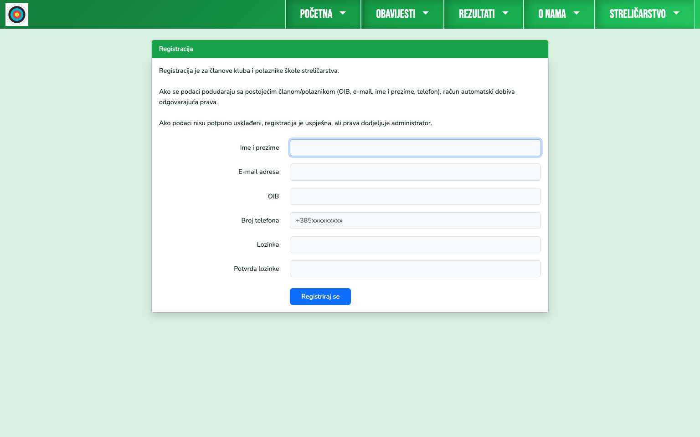
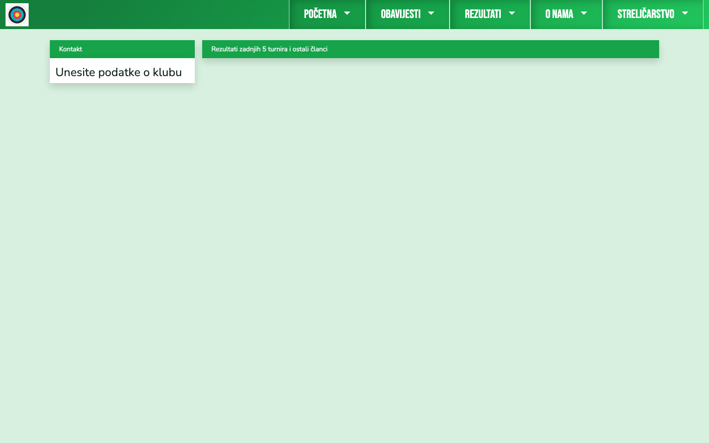
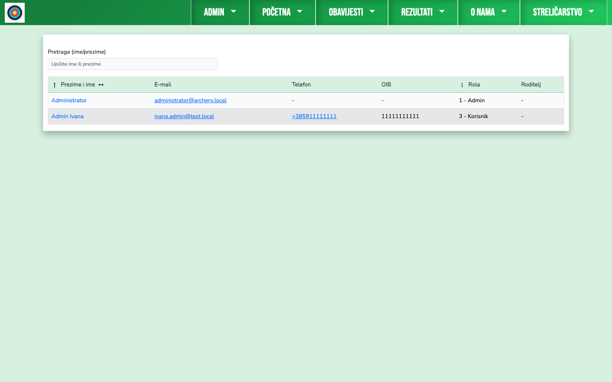
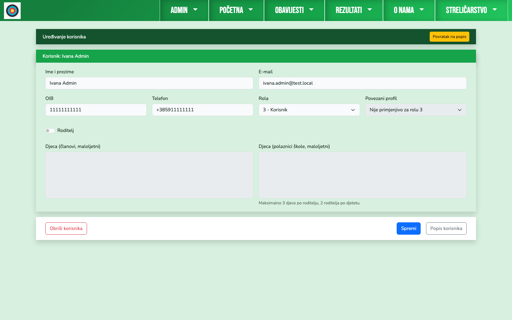
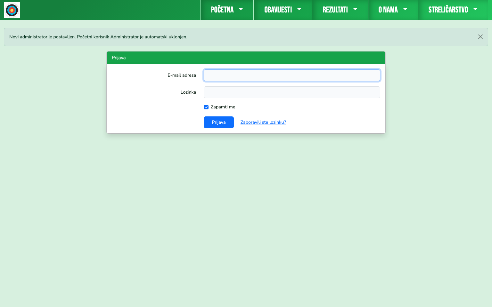
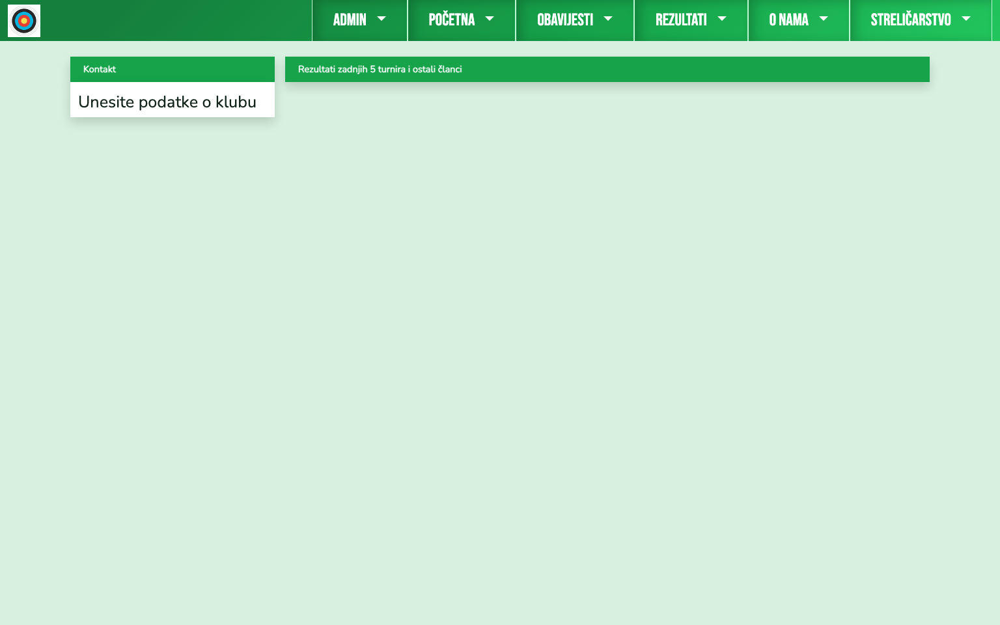

# Instalacija i prvi koraci

Ovaj vodič pokriva kompletan put od prazne instalacije do prvog funkcionalnog administratora.

## 1. Instalacija

Pokreni u rootu projekta:

```bash
composer install
cp .env.example .env
php artisan key:generate
php artisan migrate --seed
php artisan storage:link
npm install
npm run build
```

## 2. Podesi `.env`

Minimalno provjeri:

- `APP_ENV=local`
- `APP_DEBUG=false`
- `APP_URL`
- `DB_CONNECTION`, `DB_HOST`, `DB_PORT`, `DB_DATABASE`, `DB_USERNAME`, `DB_PASSWORD`

## 3. Prvi ulaz na aplikaciju

Nakon seed-a aplikacija je inicijalno prazna (osnovni menu i kontakt blok).


## 4. Registriraj stvarnog korisnika kluba

Prvo se registrira realni korisnik (budući admin).



Nakon registracije korisnik je kreiran i prijavljen kao obični korisnik.



## 5. Prijava privremenog bootstrap admina

Bootstrap admin iz seeda:

- email: `administrator@archery.local`
- lozinka: `poklonOdSKDubrava`

Nakon prijave otvara se `Admin > Korisnici`.



## 6. Predaja admin ovlasti

Otvori registriranog korisnika i postavi rolu `1 - Admin`, pa spremi.



Sustav automatski:
- briše bootstrap korisnika,
- odjavljuje trenutnu sesiju,
- traži prijavu novog administratora.



## 7. Prijava novog admina

Novi admin se prijavljuje svojim računom i nastavlja rad.


