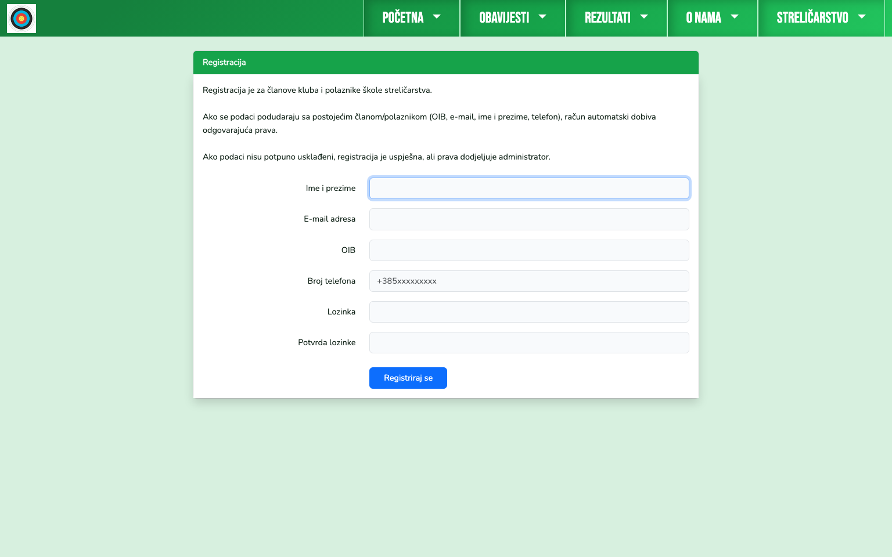
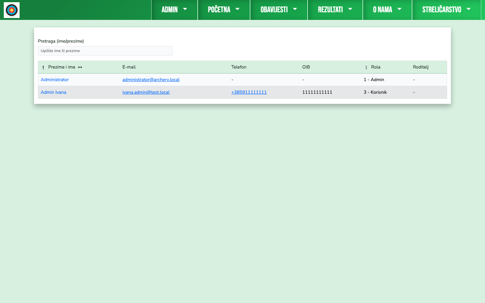
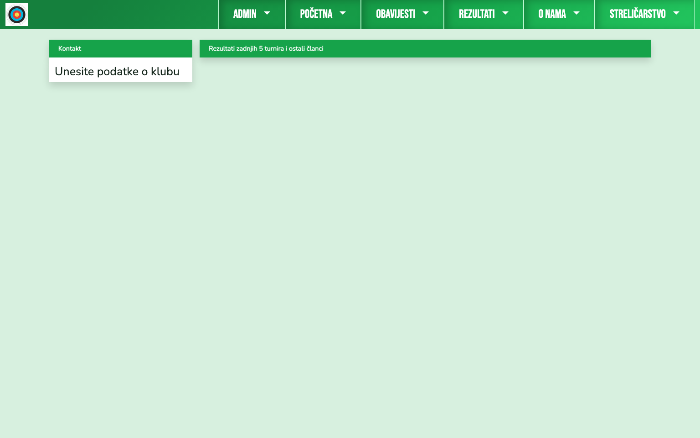

# Instalacija i prvi koraci

Ovaj vodič pokriva cijeli put od prazne instalacije do prvog stvarnog administratora koji preuzima sustav.

## 1. Preduvjeti

Prije instalacije provjeri da je okruženje spremno:

1. PHP 8.2+
2. Composer 2+
3. MySQL 8+
4. Node.js 18+ i npm
5. web server (Apache/Nginx) ili lokalno `php artisan serve`

## 2. Osnovna instalacija projekta

U rootu projekta pokreni:

```bash
composer install
cp .env.example .env
php artisan key:generate
```

Zatim u `.env` postavi barem osnovne stavke:

```dotenv
APP_NAME="Archery Club"
APP_ENV=local
APP_DEBUG=false
APP_URL=http://localhost

DB_CONNECTION=mysql
DB_HOST=127.0.0.1
DB_PORT=3306
DB_DATABASE=your_database
DB_USERNAME=your_user
DB_PASSWORD=your_password
```

## 3. Baza, seed i asseti

Pokreni migracije i početni seed:

```bash
php artisan migrate --seed
```

Napravi storage link:

```bash
php artisan storage:link
```

Složi frontend assete:

```bash
npm install
npm run build
```

Za lokalni razvoj može i:

```bash
npm run dev
php artisan serve
```

## 4. Što seed automatski postavlja

Početni seed postavlja ključne početne podatke, između ostalog:

1. stilove luka (`stilovis`)
2. kategorije (`kategorijes`)
3. tipove turnira i polja za unos rezultata (`tipovi_turniras`, `polja_za_tipove_turniras`)
4. početne teme i aktivnu default temu
5. bootstrap administratorski račun

Bootstrap admin podaci:

1. e-mail: `administrator@archery.local`
2. lozinka: `poklonOdSKDubrava`

## 5. Prvi ulaz i obavezni handover administratora

Nakon seeda početna stranica je funkcionalna, ali sustav je još uvijek na privremenom bootstrap administratoru.


Prvo registriraj stvarnog korisnika kluba (osoba koja će trajno biti administrator):




Zatim se prijavi bootstrap admin računom i otvori `Admin -> Korisnici`:



Uredi stvarno registriranog korisnika i postavi mu rolu `1 - Admin`, pa spremi:


Nakon spremanja sustav automatski:

1. odjavljuje bootstrap admin sesiju,
2. briše bootstrap korisnika,
3. traži prijavu novog administratora.




## 6. Produkcija (preporučeni oblik instalacije)

Za produkcijski deploy koristi:

```bash
composer install --no-dev --optimize-autoloader
php artisan migrate --seed --force
npm ci
npm run build
```

Ako deploy pipeline odvojeno rješava migracije/seed, prilagodi naredbe prema procesu tima.

## 7. Uvoz nadolazećih turnira (archery.hr)

Za uvoz kalendara koristi artisan komandu:

```bash
php artisan turniri:import-archery
```

Česti primjeri:

```bash
# pregled bez upisa
php artisan turniri:import-archery --year=2026 --dry-run

# uvoz nadolazećih turnira za godinu
php artisan turniri:import-archery --year=2026

# samo novi zapisi
php artisan turniri:import-archery --year=2026 --skip-existing

# uključi i prošle turnire
php artisan turniri:import-archery --year=2026 --include-past
```

## 8. Kratka provjera nakon instalacije

Instalacija se smatra uspješnom kada su ispunjena sva četiri uvjeta:

1. aplikacija se otvara bez greške,
2. stvarni korisnik je promoviran u admina,
3. bootstrap admin više ne postoji,
4. `Admin` izbornik je vidljiv novom administratoru.
