# Administrator - priručnik

Ovaj vodič pokazuje glavne ekrane i tipične adminsitratorske zadatke.

## 1. Početna administratora

Admin vidi standardnu naslovnicu, ali i admin izbornike.

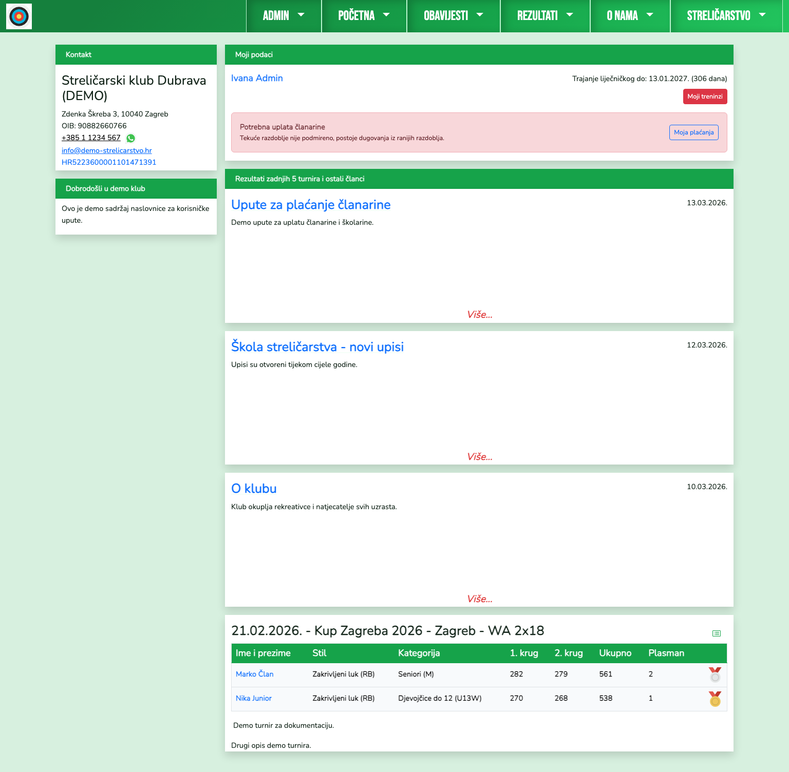

## 2. Korisnici i uloge

`Admin > Korisnici` služi za:
- promjenu role (`Admin`, `Član`, `Korisnik`, `Polaznik škole`)
- povezivanje korisnika s članom ili polaznikom škole
- uključivanje roditeljske uloge i povezivanje djece.

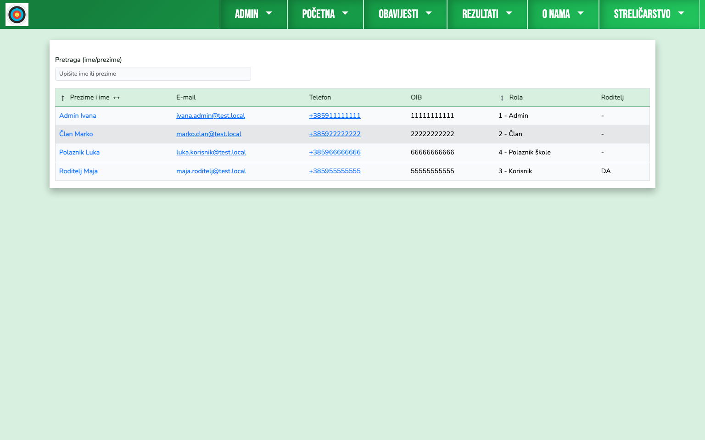
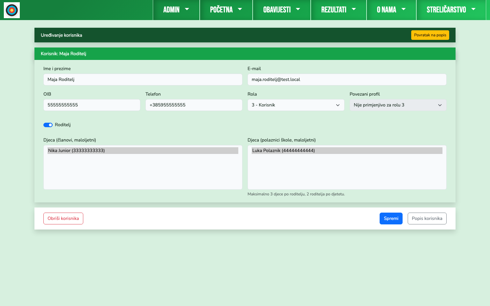

## 3. Članovi i status plaćanja

Na popisu članova admin vidi dodatnu kolonu sa stanjem plaćanja (iznos duga ili uredno stanje).

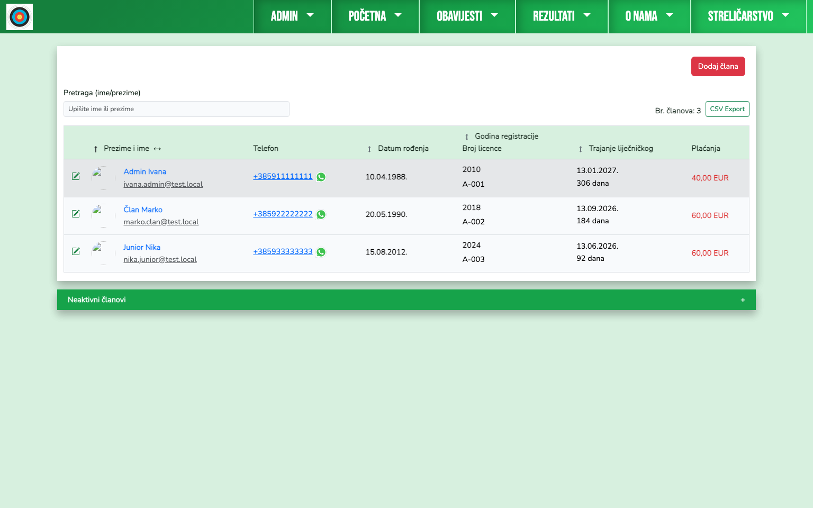

Na profilu člana (`admin/clanovi/{id}`) admin upravlja:
- modelom plaćanja
- ručnim/dodatnim stavkama
- potvrdom uplata
- pregledom povijesti stavki.

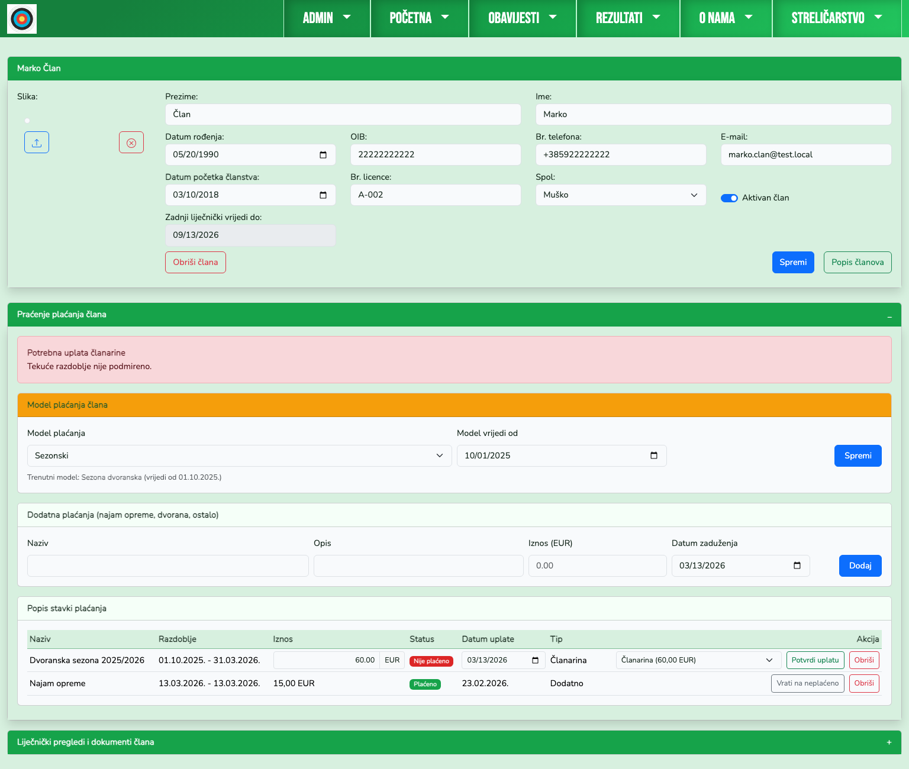

## 4. Polaznici škole i školarina

Na profilu polaznika admin vodi:
- model školarine (`u cijelosti`, `u dvije rate`, `oslobođen`)
- potvrde uplata
- praćenje druge rate nakon 8 treninga
- evidenciju dolazaka i dokumente.

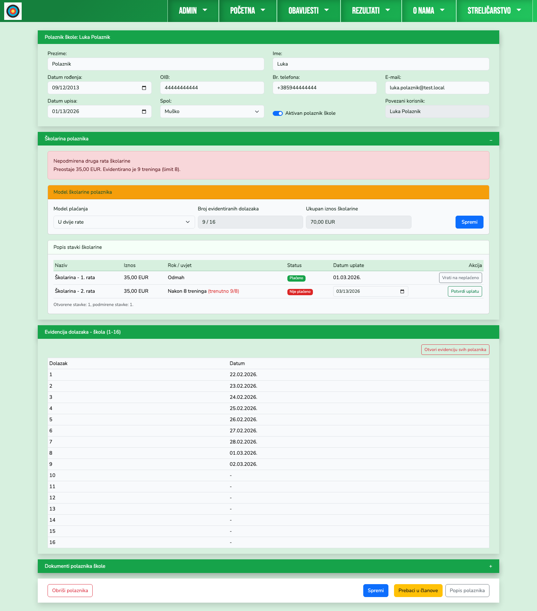

## 5. Administracija plaćanja i izvještaji

`Admin > Plaćanja` uključuje:
- setup modela plaćanja i iznosa
- filtere perioda/statusa/naplate
- sažetke dugovanja
- tablice dužnika i svih stavki
- CSV export.

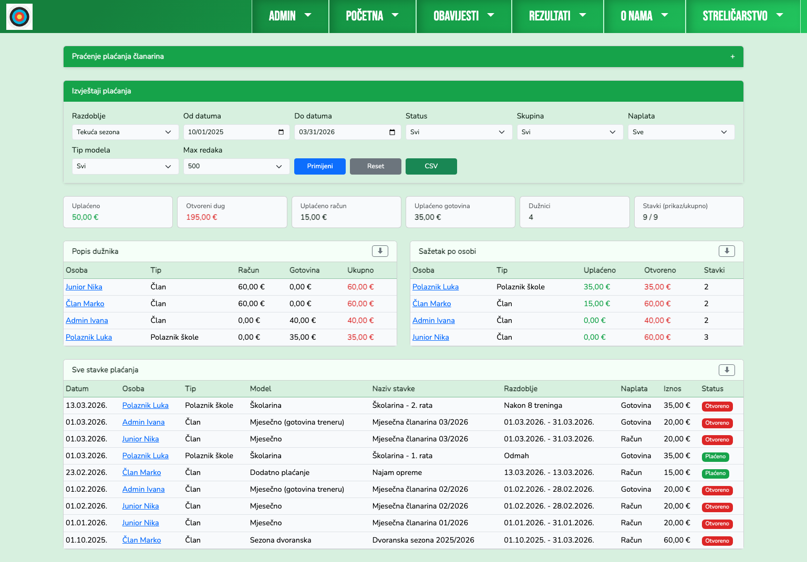

## 6. Teme, logo i favicon

`Admin > Teme`:
- odabir aktivne teme
- uređivanje boja
- light/dark varijante
- upload globalnog loga i favicona.

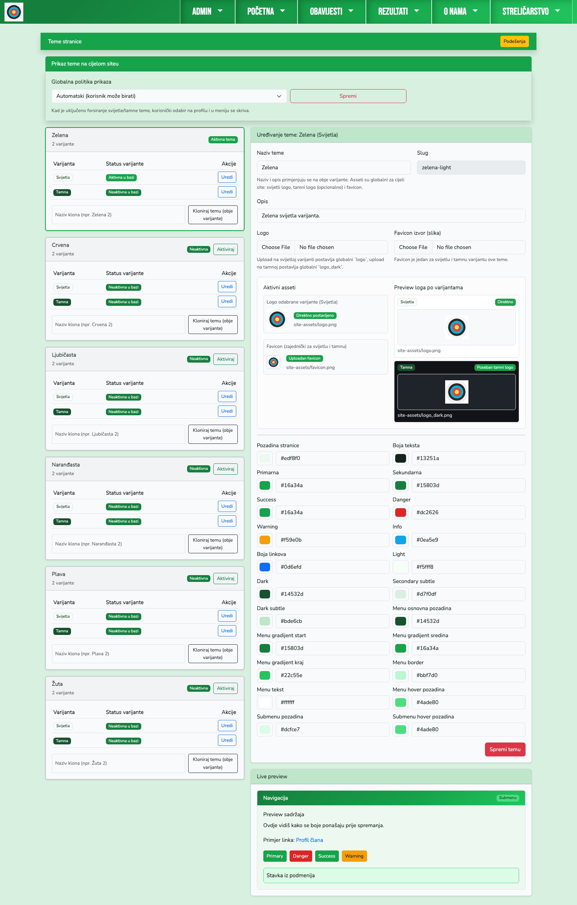

## 7. Članci i sadržaj

`Admin > Članci` prikazuje sve sadržaje.

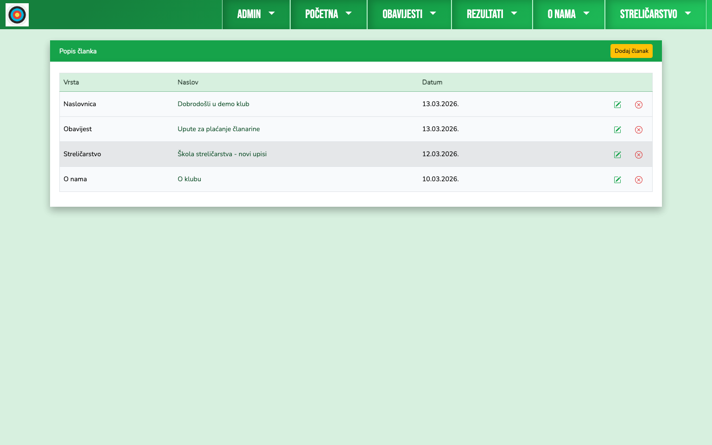

Kreiranje članka koristi CKEditor (sadržaj, menu, Facebook link, mediji).

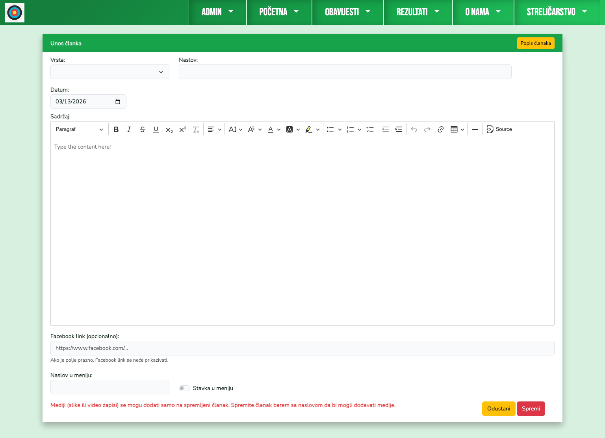

## 8. Turniri i rezultati

`Admin > Turniri` za kreiranje i pregled turnira:

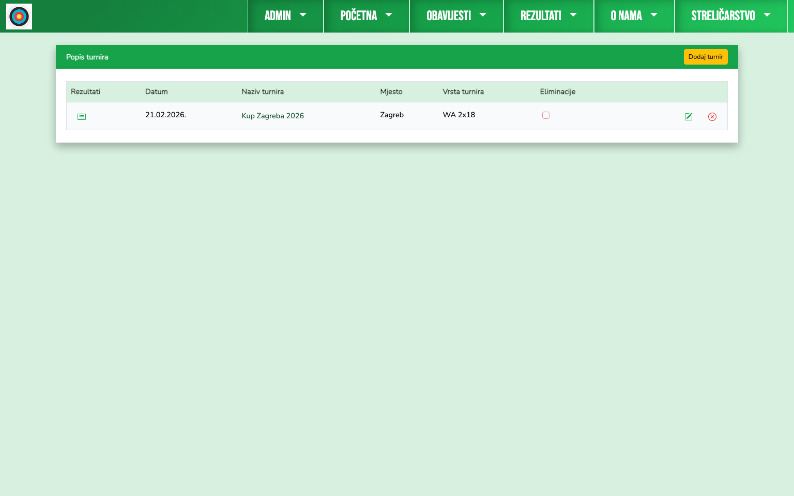

Unos rezultata po turniru:
- član
- stil
- kategorija
- polja po tipu turnira
- plasman i eliminacije
- mediji i opisi.

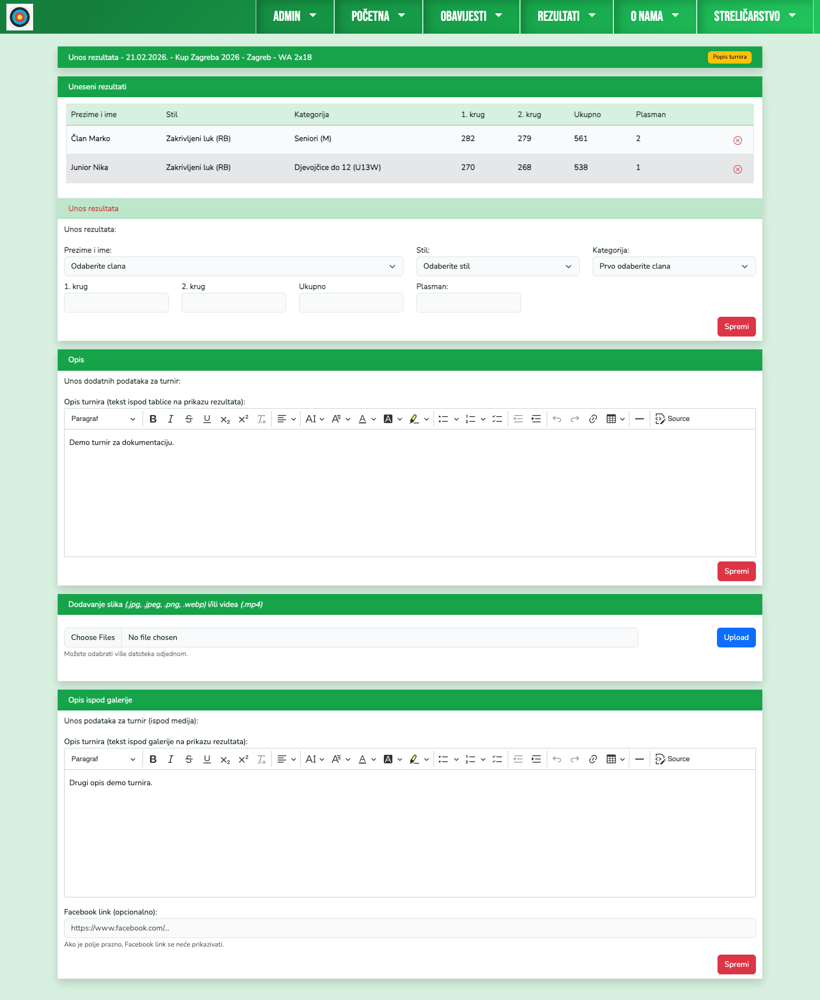
