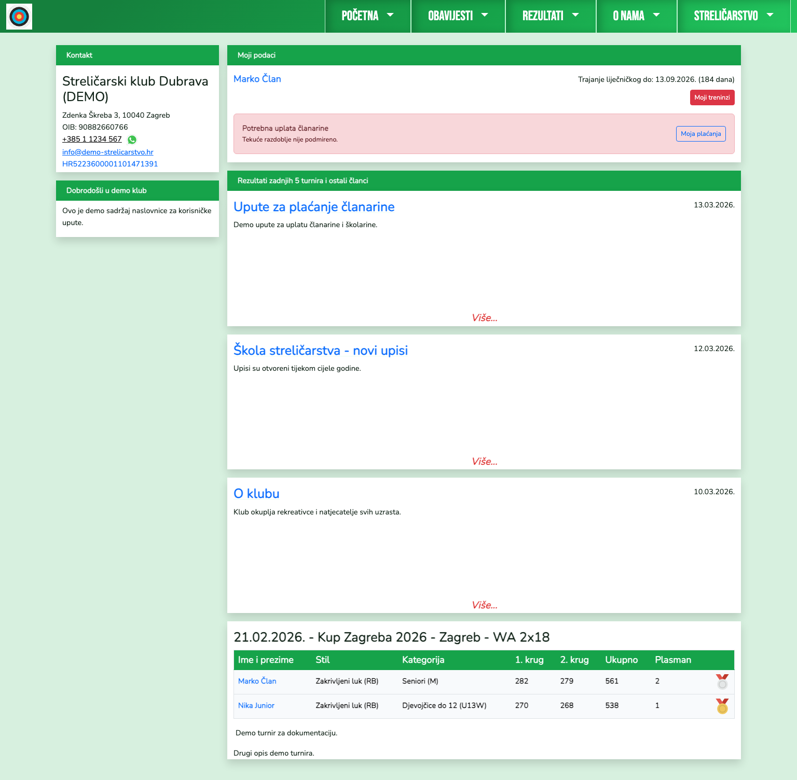
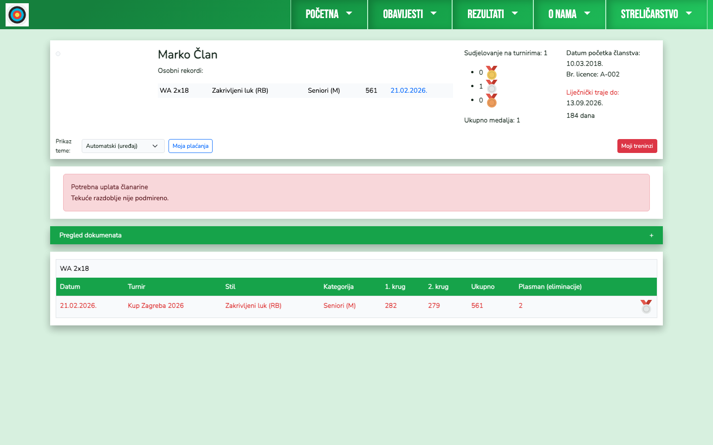
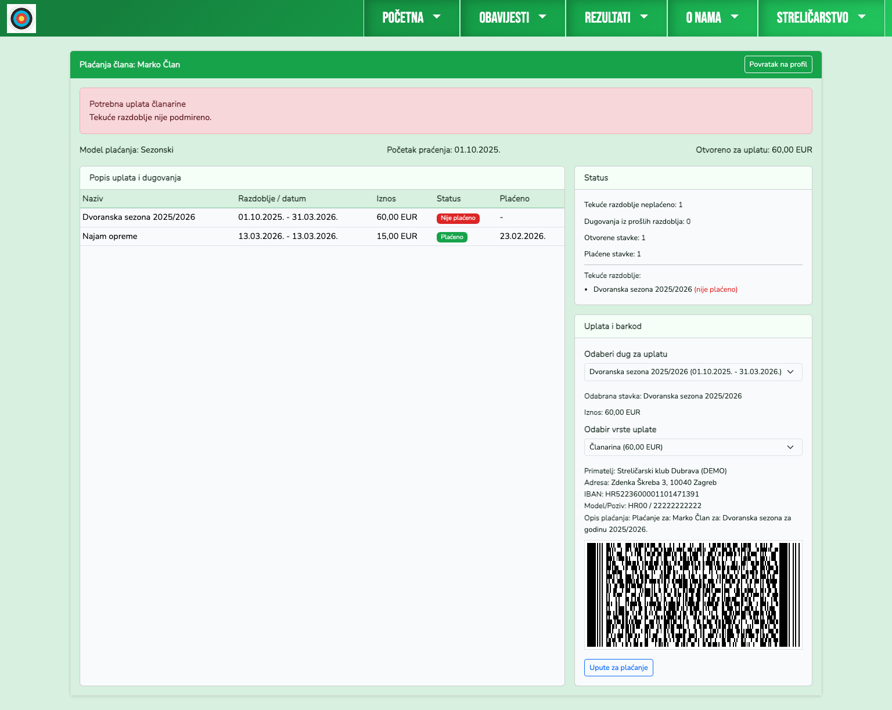
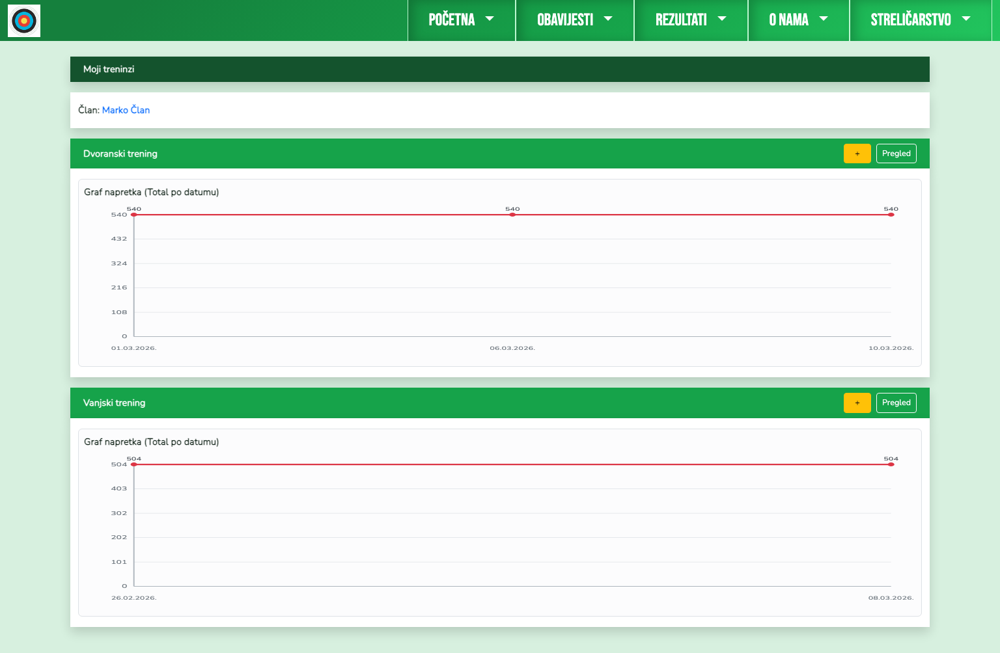
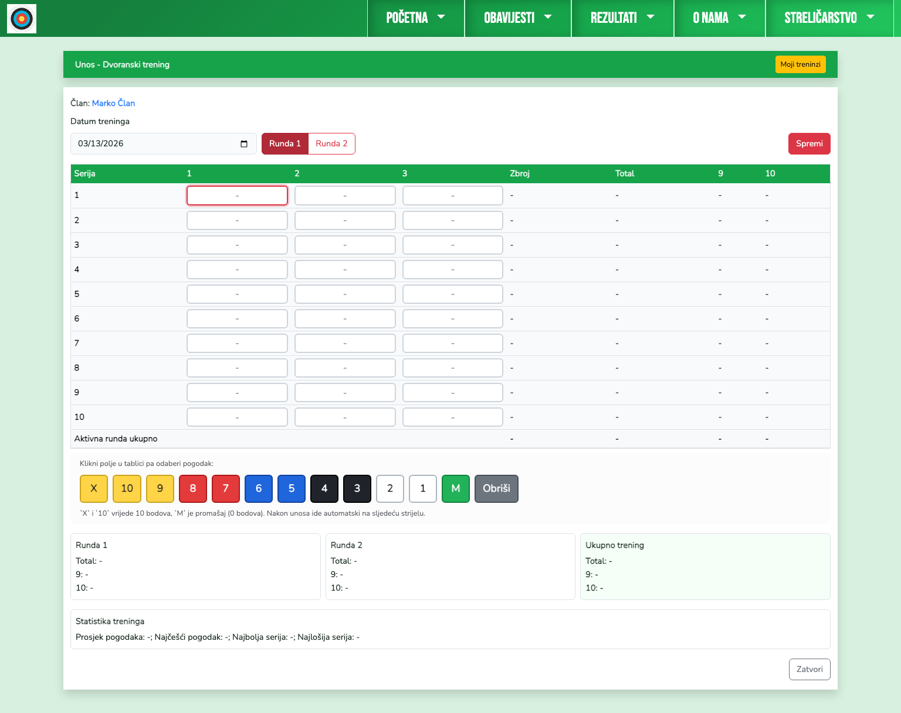
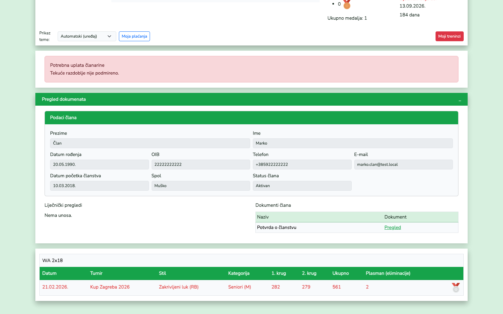
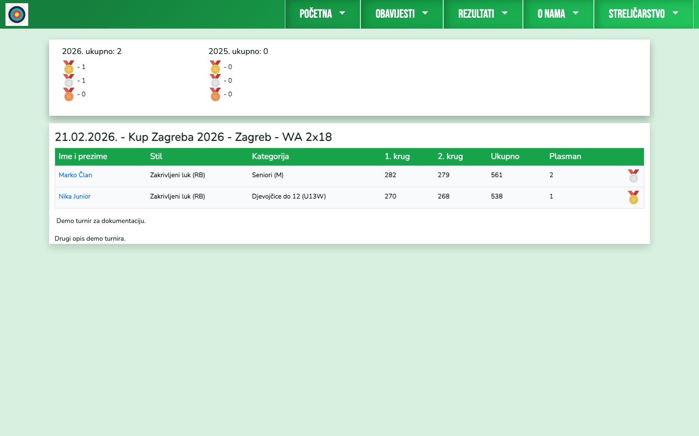

# Član - priručnik

Član vidi vlastite podatke, treninge, rezultate i plaćanja.

## 1. Naslovnica člana

Na naslovnici su:
- blok "Moji podaci"
- upozorenja (liječnički, članarina)
- brzi gumbi (`Moji treninzi`, `Moja plaćanja`)
- zadnji članci i rezultati.

## 2. Profil člana

Profil prikazuje osobne podatke, rezultate, dokumente i pripadajuće funkcionalnosti prema pravima korisnika.

## 3. Moja plaćanja

`/clanovi/{id}/placanja` prikazuje:
- listu stavki (plaćeno / neplaćeno)
- odabir duga za uplatu
- odabir vrste uplate (članarina / podupirući)
- automatski barkod za internet bankarstvo.

## 4. Moji treninzi

Član vodi vlastitu evidenciju dvoranskih i vanjskih treninga.

## 5. Unos treninga

Za svaki novi trening član otvara ekran unosa (`dvoranski` ili `vanjski`) i unosi serije/pogotke.

## 6. Pregled dokumenata

Na profilu člana, u bloku `Pregled dokumenata`, vidljiv je:
- pregled osnovnih podataka
- liječnički status
- lista dokumenata člana s linkom `Pregled`.

## 7. Rezultati

Član može pregledavati turnire i ostvarene rezultate.

