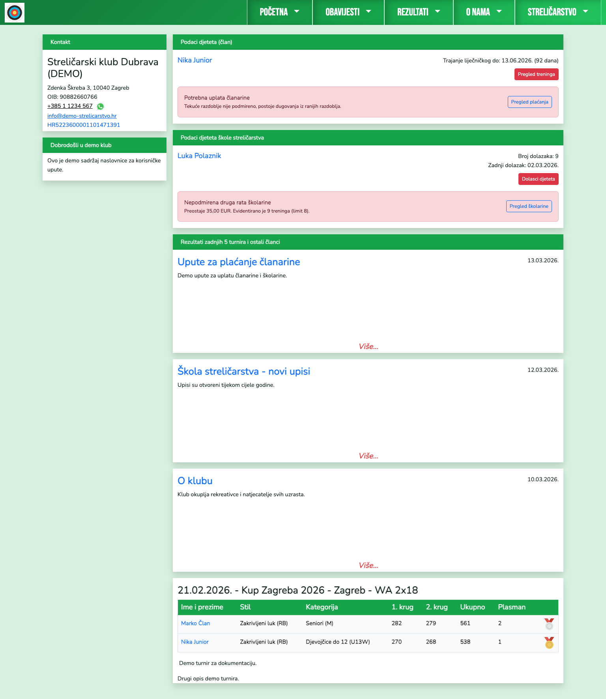
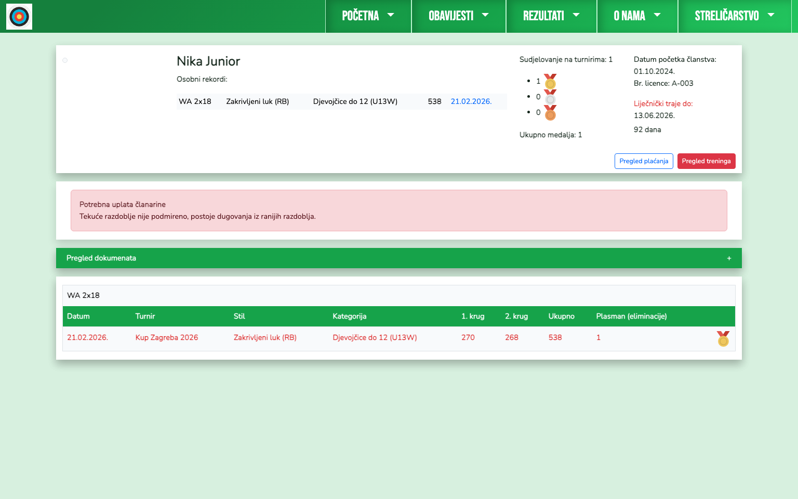
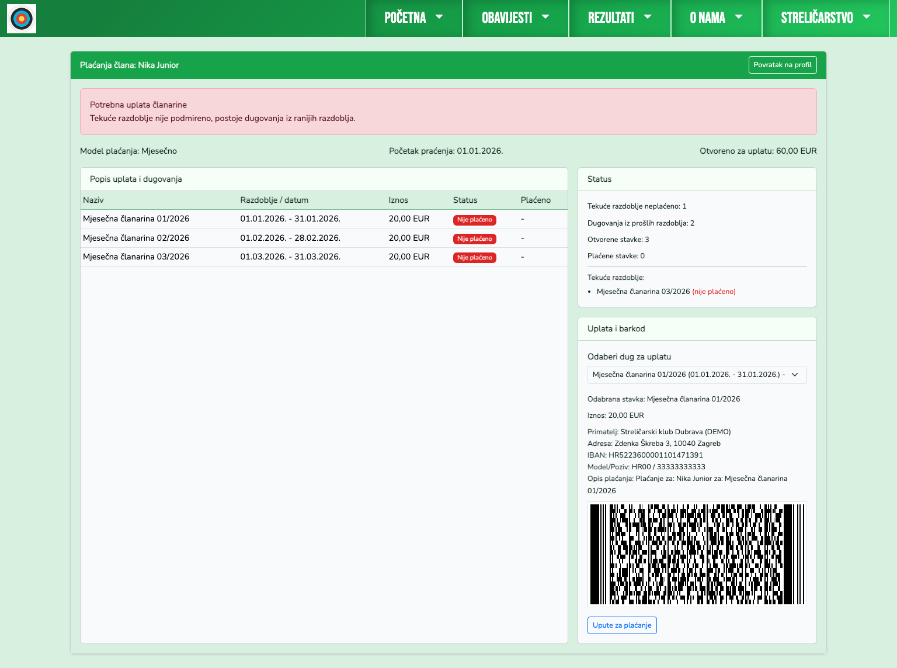
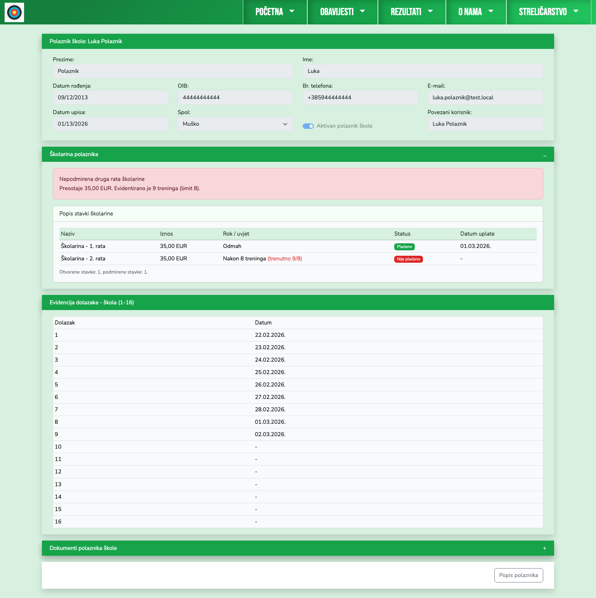

# Roditelj - priručnik

Roditelj vidi pregled svoje povezane djece (članovi i polaznici škole).

## 1. Naslovnica roditelja

Na početnoj su odvojeni blokovi po djetetu:
- član kluba (status liječničkog i članarine)
- polaznik škole (status školarine i dolasci)
- brzi gumbi za detaljni pregled.

## 2. Profil djeteta - član

Roditelj ima uvid u profil djeteta člana (podaci, status, rezultati, dokumenti prema pravima).

## 3. Plaćanja djeteta člana

Roditelj može otvoriti pregled plaćanja djeteta i koristiti barkod za uplatu.

## 4. Profil djeteta - škola streličarstva

Roditelj vidi:
- stanje školarine (npr. druga rata nakon 8 treninga)
- listu stavki školarine
- evidenciju dolazaka.

## Sigurnost pristupa

Roditelj ne vidi podatke nepovezanih članova/polaznika, nego isključivo one koji su mu povezani u `Admin > Korisnici`.
