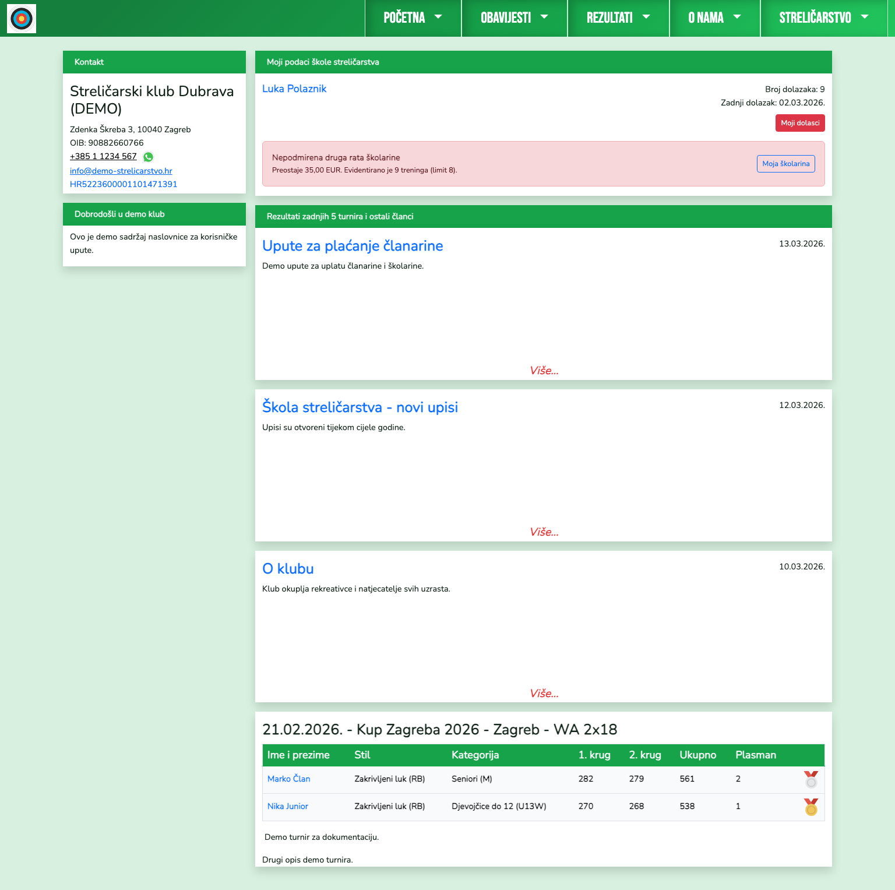
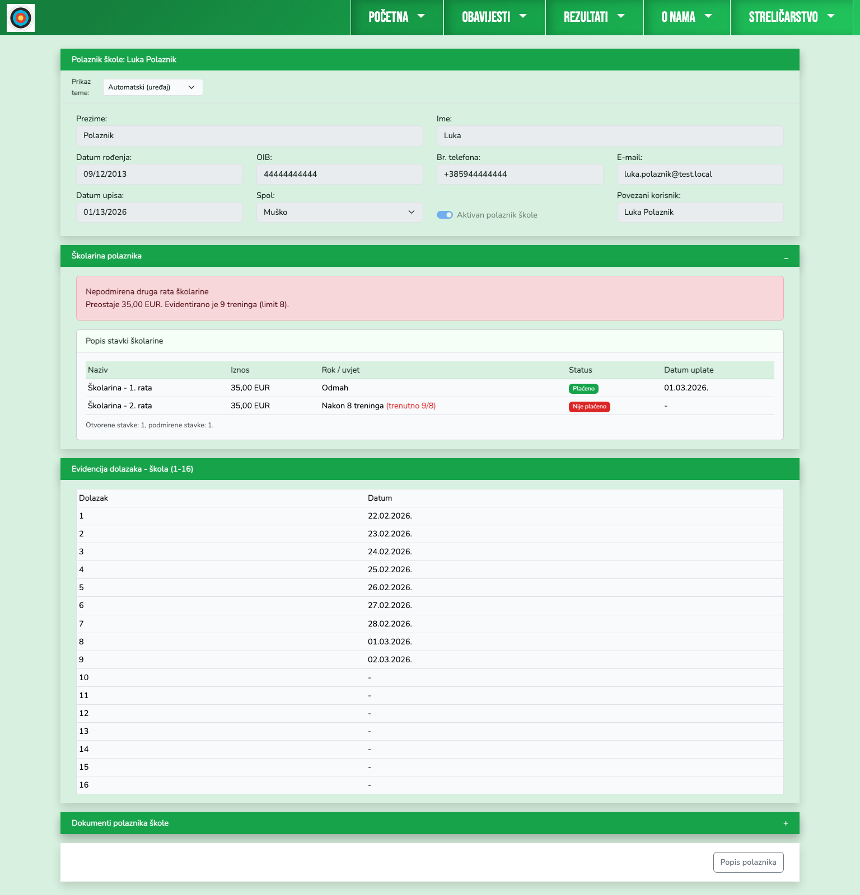

# Polaznik škole - priručnik

Polaznik škole vidi vlastiti profil, evidenciju dolazaka i status školarine.

## 1. Naslovnica polaznika

Na početnoj su prikazani osnovni podaci, status i poveznica na detaljni prikaz školarine.

## 2. Profil i školarina

Profil polaznika prikazuje:
- osobne podatke
- model školarine i stavke uplata
- upozorenja za neplaćene rate
- evidenciju dolazaka (1-16)
- dokumente polaznika.

## Napomena za školarinu

Za školarinu se koristi evidencija gotovinskih uplata kod trenera, pa se ne prikazuje barkod za internet bankarstvo.
